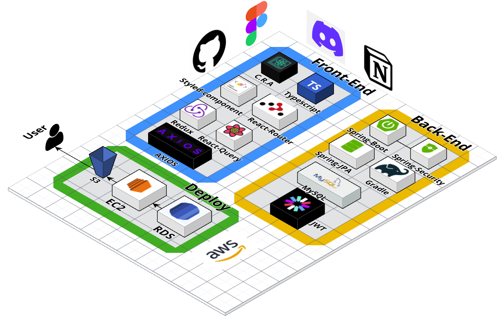

<!-- # Team. 알딸딸🍷 -->

   

   

# 나만의 칵테일을 공유하고 싶을 땐 알딸딸!🤪

   

## 🗓️ 프로젝트 기간

 

## 2023.04.28 ~ 2023.05.26

  

## 🔗 배포 링크

  
<a href='http://resevilleage-bukit.s3-website.ap-northeast-2.amazonaws.com/'>링크</a>

  

# 🍯 팀원 소개

|                                                        👑**장찬희**                                                         |                                                        🐝**이상태**                                                         |                                                                 🐝**이혜미**                                                                  |                                                  👑**최재영**                                                  |                                                  🐝**노유선**                                                  |                                                        🐝**허윤영**                                                         |
| :-------------------------------------------------------------------------------------------------------------------------: | :-------------------------------------------------------------------------------------------------------------------------: | :-------------------------------------------------------------------------------------------------------------------------------------------: | :------------------------------------------------------------------------------------------------------------: | :------------------------------------------------------------------------------------------------------------: | :-------------------------------------------------------------------------------------------------------------------------: |
|                                                         **FE** 팀장                                                         |                                                         **FE** 팀원                                                         |                                                                  **FE** 팀원                                                                  |                                                  **BE** 팀장                                                   |                                                  **BE** 팀원                                                   |                                                         **BE** 팀원                                                         |
|  |  |  |  |  |  |
|                                       [Rosevilleage](https://github.com/Rosevilleage)                                       |                                            [yammyam](https://github.com/yammyam)                                            |                                                  [Hyemmmm720](https://github.com/Hyemmmm720)                                                  |                                      [220SRS](https://github.com/220SRS)                                       |                                     [YUSUNRO](https://github.com/YUSUNRO)                                      |                                            [Heo-y-y](https://github.com/Heo-y-y)                                            |

  

# 🎨 서비스 미리보기

  

|                                              메인페이지                                              |                                             커스텀레시피                                             |                                               검색결과                                               |
| :--------------------------------------------------------------------------------------------------: | :--------------------------------------------------------------------------------------------------: | :--------------------------------------------------------------------------------------------------: |
|  |  |  |
|                                              상세페이지                                              |                                              마이페이지                                              |                                             로그인페이지                                             |
|                                                                           |                                                                       |                                                             |
| |  | |

  

## ERD 🔧

  

  

# ✨ 구현 기능

- 회원가입 
- 로그인 / 로그아웃 
- 데이터 유효성 검사 
- 마이페이지 
- 정규 레시피 조회 
- 커스텀 레시피 등록 
- 커스텀 레시피 삭제 
- 커스텀 레시피 수정 
- 마이페이지 수정 
- 북마크 등록 / 해제 / 조회 
- 검색 기능 
- 검색 페이지 내 정규, 커스텀 분류 
- AWS EC2 서버 배포 
- AWS S3 클라이언트 배포 

   

# 💻 사용 기술

## Frontend 🥳

  

## Backend 🤩

  

## Collaboration Tools 🤝

 
 

  

  

# 🤖 커밋 규칙

ex) git commit -m “**Feat:** commit messages”
| 커밋명 | 의미 |
| :---: | :---: |
| Feat | 새로운 기능 추가|
| Fix | 버그 수정 |
| Docs | 문서 수정|
| Style | 코드 formatting, 세미콜론 누락, 코드 자체의 변경이 없는 경우 |
| Refactor | 코드 리팩토링|
| Test | 테스트 코드, 리팩토링 테스트 코드 추가 |
| Chore | 패키지 매니저 수정, 그 외 수정 |
| Design | CSS 등 사용자 UI 디자인 변경 |
| Comment | 필요한 주석 추가 및 변경 |
| Rename | 파일 또는 폴도 명 수정 혹은 옮기는 작업 |
| !BREAKING CHANGE | 커다란 API 변경하는 경우 |
| !HOTFIX | 급하게 치명적인 버그를 고쳐야 하는 경우 |
| Setting | 기본 세팅 변경의 경우 |
